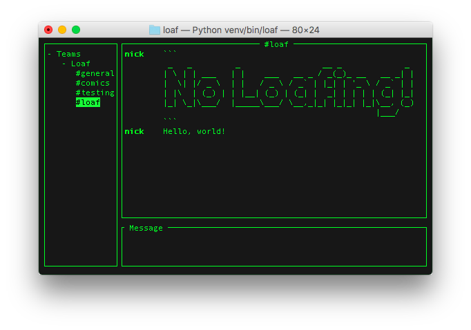

# Loaf
Loaf is a slack client written in python



## Why?
I wanted to write a slack client in python.


## Getting started

1. Get a slack token for your team here: https://api.slack.com/custom-integrations/legacy-tokens
2. Create a `config.json` file for each of your teams with the token generated in step #1:

    ```
    {
        "team": [
            {
                "name": "slack team #1",
                "token": "xoxp-..."
            }
            {
                "name": "slack team #2",
                "token": "xoxp-..."
            }
        ]
    }
    ```
3. Run the client

    ```
    $ venv/bin/loaf
    ```

## Notes
This is more of a proof of concept than anything. at the moment loaf is very bare bones and is not meant for everyday use. 

The Slack API wrapper is extremely bare bones, since I only impemented what I needed. Existing Asyncio aware API wrappers like 'slacker' weren't used since I wanted to write my own wrapper

This is the first application I've written using urwid, so pull requests are welcomed to help improve the code.
